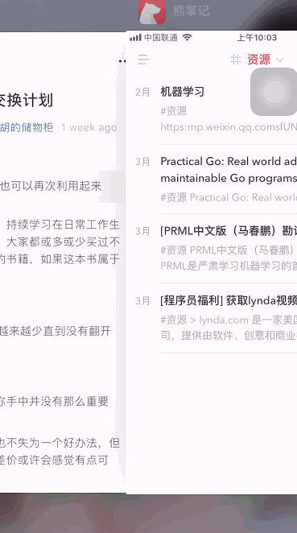

## 利用微信同步文章到Bear

在我日常工作中，我会将各种互联网以及生活中产出的信息汇总到Bear，再通过Bear的云同步使我各个终端的信息保持一致。以前在使用有道云笔记的时候，有个功能我很喜欢，就是当看到一篇想收藏的文章的话，就可以直接右上角发送到有道云笔记。

我现在面临的需求是能不能在看到喜欢的文章的时候，也通过类似于点击右上角`分享一下`就可以直接将文章同步到我各个终端上的`Bear`，最终效果如下：

<p align="center">

</p>

### 解决方案

要实现上述的需求，我大概思考了如下的解决方案：

1.  准备一个微信号（这里直接称作小号）专门接收待收藏到Bear的文章
    
2.  编写一个服务监控小号的消息，比如收到推文类型的消息就进行内容提取
    
3.  监控服务将提取后的内容发送到Bear（这里要求服务运行在Mac OS上）
    

所以在继续之前，你需要有以下条件：

-   基本的Python基础知识（写小脚本Python真的很方便）
    
-   一台装有Bear的Mac OS

### 使用

```shell
git clone https://github.com/howie6879/w2b
cd w2b
# 推荐使用pipenv 你也可以使用自己中意的环境构建方式
pipenv install --python=/Users/howie6879/anaconda3/envs/python36/bin/python3.6  --skip-lock
# 运行前需要填好配置文件
pipenv run python w2b/run.py
```

首先请按照[利用微信同步文章到Bear](https://mp.weixin.qq.com/s/qRQO9xMvGTQL-ysolXJAxQ)提到的方式确定以下常量：

-   S_ACCOUNT_ID：微信发送账户ID，可以在`Account/userinfo.data`下查看

-   R_ACCOUNT_ID：微信接收账户ID，同上
    
-   RAW_KEY：解密Key，就是上面介绍的64位字符串
    
-   DB_PATH_TEM：定义的是消息DB路径，比如："/Users/howie6879/Library/Containers/com.tencent.xinWeChat/Data/Library/Application Support/com.tencent.xinWeChat/2.0b4.0.9/{0}/Message/"

对应是 `w2b/config.py` 中的配置：

```python
import os

from w2b.utils.tools import gen_md5


class Config:
    # 微信发送账户ID
    S_ACCOUNT_ID = os.environ.get("S_ACCOUNT_ID", "")
    # 微信接收账户ID
    R_ACCOUNT_ID = os.environ.get("R_ACCOUNT_ID", "")
    # 解密Key
    RAW_KEY = os.environ.get("RAW_KEY", "")
    # 消息DB路径
    DB_PATH_TEM = "/Users/howie6879/Library/Containers/com.tencent.xinWeChat/Data/Library/Application Support/com.tencent.xinWeChat/2.0b4.0.9/{0}/Message/"
    # 微信接收账户所有消息DB文件夹
    MSG_DB_DIR = DB_PATH_TEM.format(gen_md5(R_ACCOUNT_ID))
    # 与目标微信账户的聊天表
    MSG_TABLE_NAME = f"Chat_{gen_md5(S_ACCOUNT_ID)}"
    # 笔记Tag
    BEAR_TAG = "资源/微信"
    # 多久扫描一次，单位是S
    INTERVAL = 10
```

### 最后

欢迎提 `Issue`，希望可以帮到你~